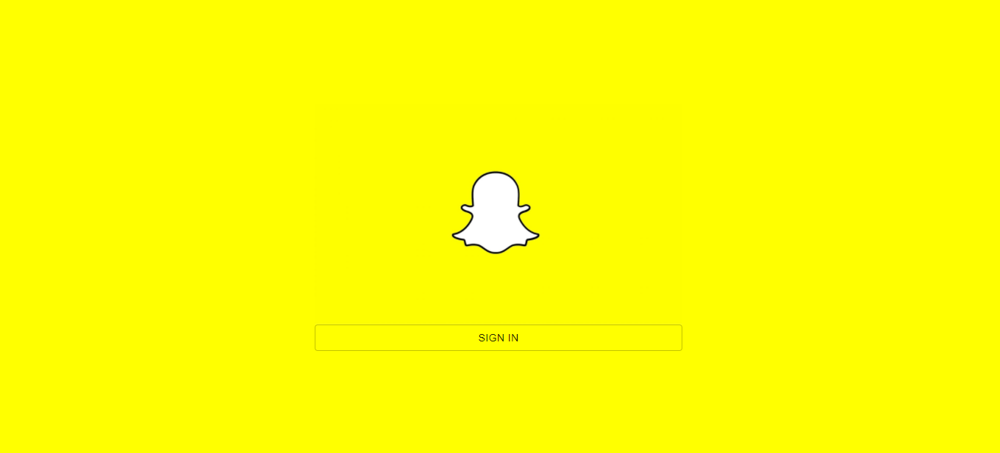
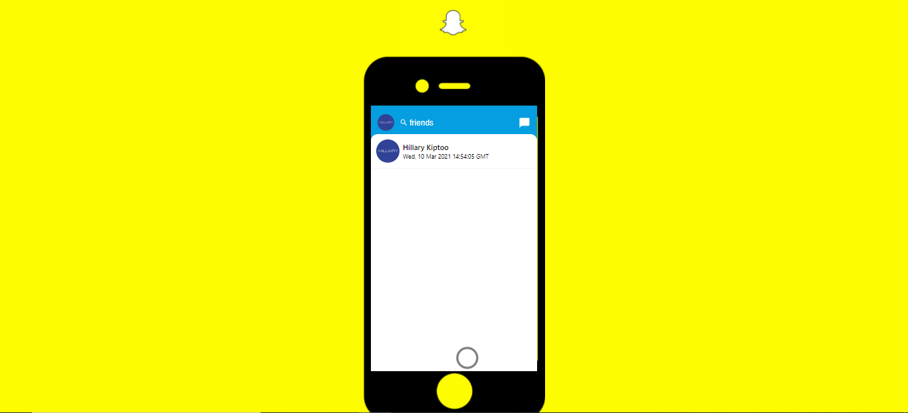

# Snap Chat 

>  Snapchat !

## Description

Snapchat is a snapchat clone built with React, Redux, Firebase, Google Auth, React hooks. This snapchat clone allows users to login, take snaps, view others snaps. Users can login take snaps, view all snaps.

## Live version

Heres a live <a href="https://snapchat-387f2.web.app/">link</a>

<!--  -->

## Features

Slack 2.0 web  app has the following features
- Create snaps.
- View all users snaps.
- Firebase auth login.

## Built with

- HTML
- Git
- CSS
- JavaScript
- Shields.io
- Webpack
- npm
- command-line tools such as git.
- React
- create-react-app-buildpack
- Redux
- Firebase
- React Hooks

## Author

Reach out!

👤 **Hillary Kiptoo**

- LinkedIn: [Hillary Kiptoo](https://www.linkedin.com/in/hillarykiptoo)
- Github: [@imhilla](https://github.com/imhilla)
- Twitter: [@hillarykiptoo](https://twitter.com/hillarykiptoo_)

## Acknowledgments

- Thanks to Microverse for its support!

## Show your support

Give a ⭐️ if you like this project!

## License

- **[MIT license](http://opensource.org/licenses/mit-license.php)**
